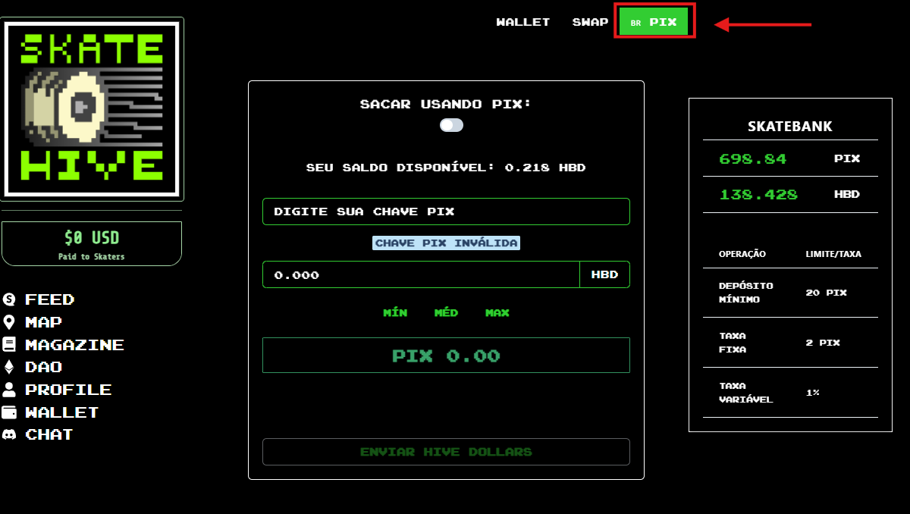
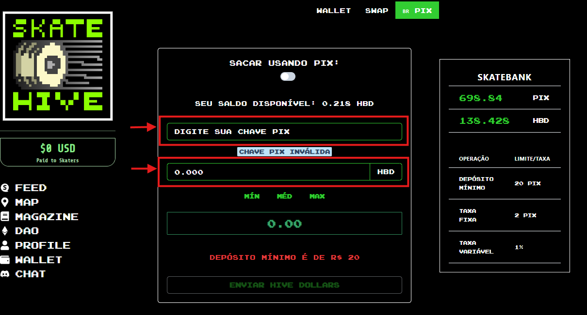
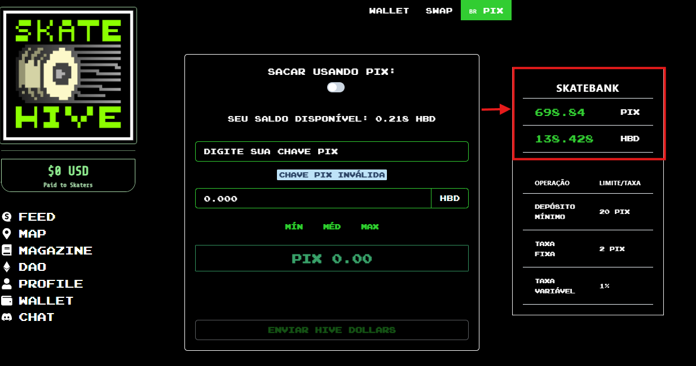

# Usando Pix na SkateHive

Primeiro abra sua wallet e selecione a função pix

Prencha com os dados requisitados inserindo sua chave pix, e o valor em HBD que deseja tranferir. Lembre-se que existe um limite mínimo de 20 reais.

Você pode conferir o saldo atual do banco antes de realizar a sua transação.

Após finalizar basta clicar no botão e enviar seu hive dollars. sera retornado uma menssagem em até 24 horas.